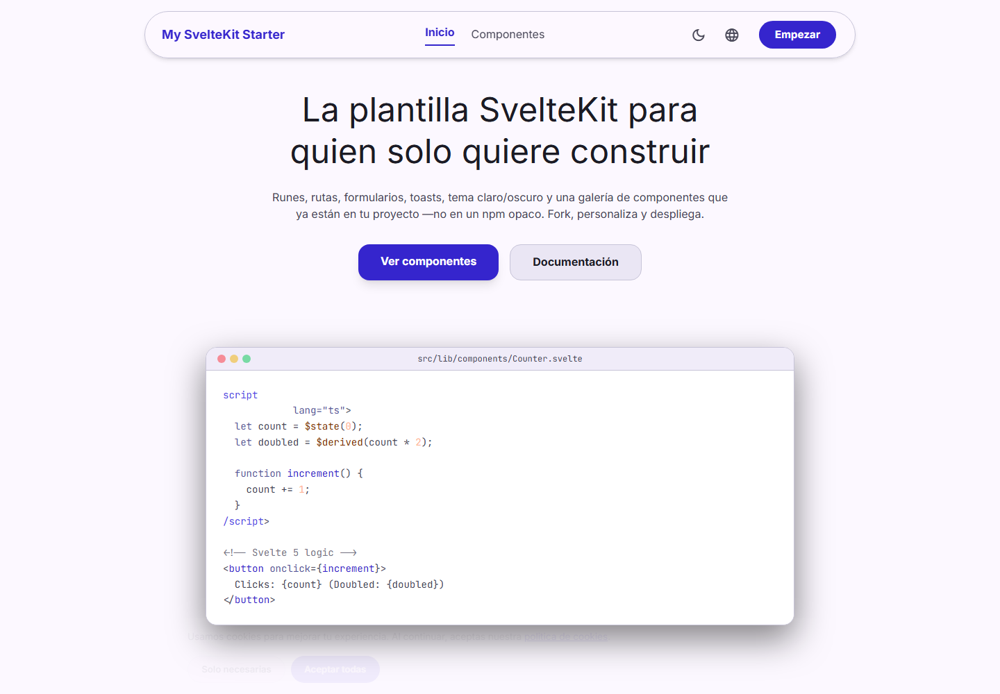
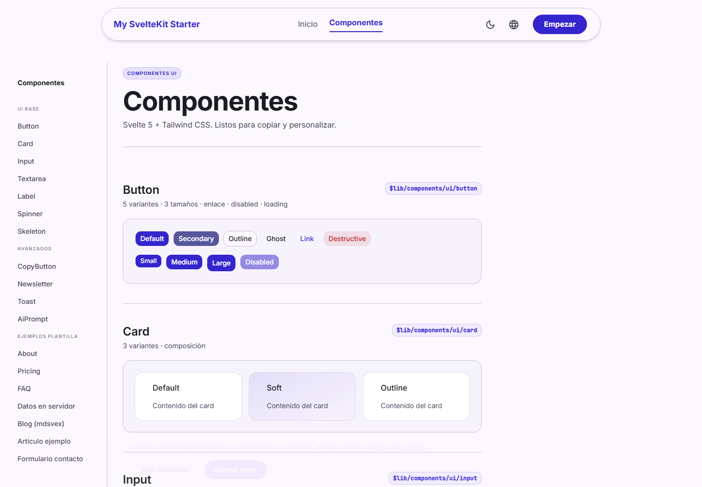

# My SvelteKit Starter

Production-minded SvelteKit starter with Svelte 5 runes, TypeScript, Tailwind CSS v4, shadcn-svelte style components, i18n, SEO, GEO and AEO already wired.

[](https://svelte.dev)
[](https://kit.svelte.dev)
[](https://www.typescriptlang.org/)
[](https://tailwindcss.com/)
[](https://vitest.dev/)
[](./LICENSE)

[Live demo](https://my-sveltekit-starter.vercel.app/) · [Spanish quick start](./INICIO_RAPIDO.md) · [Design handoff guide](./DESIGN_TO_CURSOR.md) · [GEO playbook](./GEO_PLAYBOOK.md)

## Preview





## Why This Starter

Most starters stop at routing and styling. This one is built for shipping a real website or product surface quickly:

- Svelte 5 runes and SvelteKit 2 with TypeScript.
- Tailwind CSS v4 with a shadcn-svelte inspired component layer.
- ES/EN i18n, dark mode, toasts, cookie consent and responsive layout.
- Central SEO store with Open Graph, Twitter cards, canonical URLs and JSON-LD.
- GEO/AEO endpoints for modern AI discovery: `llms.txt`, Markdown twins and content negotiation.
- Security headers, CSP, HSTS in production, frame protection and strict cookie defaults.
- Optional Sanity, Supabase and Sentry wiring without making them mandatory.
- CI, Husky, lint-staged, Vitest and `svelte-check` already configured.

## Stack

| Area              | Included                                                         |
| ----------------- | ---------------------------------------------------------------- |
| Framework         | SvelteKit 2, Svelte 5 runes                                      |
| Language          | TypeScript                                                       |
| Styling           | Tailwind CSS v4, design tokens, shadcn-svelte style components   |
| UI primitives     | bits-ui, mode-watcher, lucide-svelte, svelte-sonner              |
| Quality           | ESLint, Prettier, svelte-check, Vitest                           |
| SEO/GEO/AEO       | sitemap, robots, Open Graph, JSON-LD, `llms.txt`, Markdown twins |
| Optional services | Sanity CMS, Supabase, Sentry                                     |
| Deploy            | Vercel adapter, Netlify config included                          |

## Quick Start

Requirements: Node.js 22 or newer.

```bash
pnpm install
pnpm run dev
```

Open `http://localhost:5173`.

You do not need a `.env` file for the default demo. Add one only when enabling optional services.

## Scripts

| Command                 | Purpose                                          |
| ----------------------- | ------------------------------------------------ |
| `pnpm run dev`          | Start the Vite development server                |
| `pnpm run build`        | Create a production build                        |
| `pnpm run preview`      | Preview the production build locally             |
| `pnpm run format:check` | Check formatting with Prettier                   |
| `pnpm run format`       | Format project files                             |
| `pnpm run lint`         | Run Prettier check and ESLint                    |
| `pnpm run check`        | Run `svelte-check` with the project tsconfig     |
| `pnpm test`             | Run Vitest                                       |
| `pnpm run new:page`     | Scaffold a page from the local script            |
| `pnpm run clean`        | Remove demo routes/components for a lean project |
| `pnpm run studio`       | Start Sanity Studio, if configured               |

## Quality Gate

Before publishing changes, run:

```bash
pnpm run format:check
pnpm run lint
pnpm run check
pnpm test
pnpm run build
pnpm audit --audit-level=moderate
```

Current local verification has been hardened so pnpm audit reports zero vulnerabilities after the dependency overrides in `package.json`.

## Project Structure

```txt
src/
  routes/
    +page.svelte              Home page
    +layout.svelte            App shell, SEO tags, nav, theme, toasts
    components/               Component gallery and demos
    api/og/+server.ts         Dynamic Open Graph SVG endpoint
    *.md/+server.ts           Markdown twin endpoints for AEO
  lib/
    components/ui/            shadcn-svelte style base components
    components/               Project components and demos
    aeo/                      Markdown twins, content negotiation, token counting
    i18n/                     ES/EN dictionaries and locale helpers
    server/                   Server-only Sanity and Supabase helpers
    styles/stitch-m3.css      Design tokens and typography utilities
    seo.ts                    Central SEO store
    site-config.ts            Site identity, URLs and social defaults
    site-pages.ts             Registry for sitemap, llms.txt and twins
static/
  screenshots/                README screenshots
sanity/                       Optional CMS schema and seed scripts
```

## UI System

The starter keeps the UI code in your repository, not hidden behind an opaque package.

Base components live in `src/lib/components/ui/`:

- `Button`
- `Card`
- `Dialog`
- `Input`
- `Textarea`
- `Label`
- `Skeleton`
- `Spinner`
- `Sonner`
- Layout helpers: `Container`, `Section`, `Grid`, `Heading`, `Text`, `HeroSection`, `FeaturesSection`

Project components live in `src/lib/components/`:

- `Footer`
- `CookieConsent`
- `CopyButton`
- `Newsletter`
- `AiPrompt`
- `JsonLd`
- `ToastContainer`
- Demo blocks under `src/lib/components/demos/`

## SEO, GEO and AEO

The starter is designed for search engines and AI answer engines.

One `setSeo({...})` call per page feeds:

- `<title>`, description, keywords, author and canonical URL.
- Open Graph and Twitter cards.
- JSON-LD for `Organization`, `WebSite`, `BreadcrumbList`, page schema, FAQ, HowTo and SoftwareApplication.
- `hreflang` alternates for ES/EN.

Dynamic discovery endpoints:

| Endpoint                      | Purpose                                          |
| ----------------------------- | ------------------------------------------------ |
| `/sitemap.xml`                | HTML pages and Markdown twin URLs with hreflang  |
| `/robots.txt`                 | Search and AI crawler policy                     |
| `/llms.txt`                   | Compact Markdown index for LLMs                  |
| `/llms-full.txt`              | Full-site Markdown export                        |
| `/index.md`, `/components.md` | Clean Markdown twins                             |
| `Accept: text/markdown`       | Content negotiation for agent-friendly responses |
| `/api/og?title=...`           | Dynamic Open Graph image                         |

To add a page to the whole SEO/GEO/AEO pipeline:

1. Create the SvelteKit route.
2. Call `setSeo({...})` in the page.
3. Add the page to `src/lib/site-pages.ts`.
4. Add a Markdown builder in `src/lib/aeo/builders/`.
5. Register the builder and add a sibling `.md` route.

## Security Notes

Implemented by default:

- Content Security Policy in `src/hooks.server.ts`.
- `Strict-Transport-Security` in production.
- `X-Frame-Options: DENY`.
- `X-Content-Type-Options: nosniff`.
- `Referrer-Policy: strict-origin-when-cross-origin`.
- Restrictive `Permissions-Policy`.
- `frame-ancestors 'none'`.
- Locale cookie uses `httpOnly`, `sameSite: 'lax'` and `secure` in production.
- Private service keys stay in `$env/dynamic/private`.
- pnpm dependency audit is clean with the included overrides.

Review before production:

- Replace or remove `/api/hello`, it is intentionally a demo endpoint.
- Keep `PUBLIC_SITE_URL` accurate for canonical URLs, sitemap and Open Graph.
- Treat `SANITY_READ_TOKEN`, `SUPABASE_ANON_KEY` and `RESEND_API_KEY` as environment-specific credentials.
- If you enable third-party analytics or live chat, update CSP allowlists deliberately.

## Optional Integrations

Copy `.env.example` to `.env` when enabling services:

```bash
PUBLIC_SITE_URL=http://localhost:5173

SANITY_PROJECT_ID=
SANITY_DATASET=production
SANITY_API_VERSION=2024-01-01
SANITY_READ_TOKEN=

SUPABASE_URL=
SUPABASE_ANON_KEY=

PUBLIC_SENTRY_DSN=
RESEND_API_KEY=
```

### Sanity

The repo includes `sanity/`, `sanity.config.ts`, `sanity.cli.ts`, server helpers and sample GROQ mapping. Without env vars, the app still runs normally.

```bash
pnpm run studio
```

### Supabase

`src/lib/server/supabase/client.ts` returns `null` until `SUPABASE_URL` and `SUPABASE_ANON_KEY` are configured.

### Sentry

Client tracking is disabled in dev and only starts when `PUBLIC_SENTRY_DSN` exists.

## Deploy

### Vercel

This starter ships with `@sveltejs/adapter-vercel`.

```bash
pnpm run build
```

Connect the repository to Vercel and set `PUBLIC_SITE_URL` to the production URL.

### Netlify

`netlify.toml` is included. Set the same environment variables in the Netlify dashboard.

## For AI-Assisted Workflows

This repository includes agent-facing documentation:

- `AGENTS.md` for repository rules and Svelte 5 patterns.
- `PROMPTS.md` with copy-paste prompts.
- `DESIGN_TO_CURSOR.md` for mapping Stitch, Lovable or Figma exports into this component system.
- `GEO_PLAYBOOK.md` for AI discovery and Markdown twin workflows.

## License

MIT. Use it for personal, client and commercial projects.
