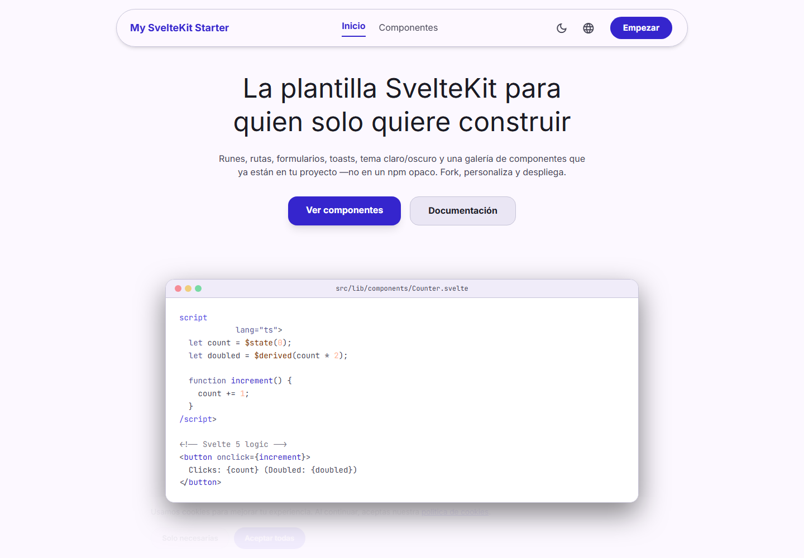
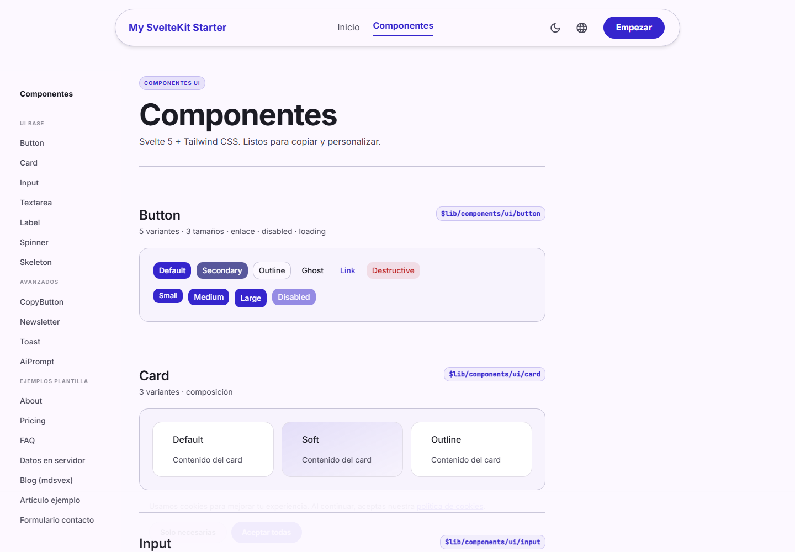

<div align="center">

# My SvelteKit Starter ⚡️

### Production-ready SvelteKit 2 & Svelte 5 template engineered for collaboration with AI coding agents

A lightweight, high-performance foundation built from the ground up for developer-agent workflows (Claude Code, Cursor, Codex, OpenCode, Antigravity, Copilot, Gemini). Pre-configured with Svelte 5 Runes, strict boundaries, modular agent instructions, instant Rust tooling, and full-stack capabilities.

[](https://svelte.dev)
[](https://kit.svelte.dev)
[](https://www.typescriptlang.org/)
[](https://tailwindcss.com/)
[](https://better-auth.com)
[](https://prisma.io)
[](https://polar.sh)
[](https://oxc.rs)
[](https://vitest.dev/)
[](./LICENSE)

<br />

[🌐 **Live Demo**](https://my-sveltekit-starter.vercel.app/) • [🇪🇸 **Inicio Rápido**](./INICIO_RAPIDO.md) • [⚡ **Deploy on Vercel**](https://vercel.com/new/clone?repository-url=https://github.com/moisesvalero/my-sveltekit-starter) • [⭐ **Star on GitHub**](https://github.com/moisesvalero/my-sveltekit-starter)

<br />



<br />



</div>

---

## 🤖 Why This Template for AI Coding Agents?

Most starter templates are built solely for human developers, ignoring how LLMs parse codebases. This template is architected specifically to maximize the reasoning power, accuracy, and execution speed of AI coding assistants:

- **Svelte 5 Runes Native**: Crystal-clear state management using modern `$state`, `$derived`, and `$effect`, making reactive logic predictable and trivial for AI models to reason about without reactivity bugs.
- **Context-Window Optimized**: No barrel files (`index.ts`) in internal modules, preventing token bloat and circular dependencies. All rule files are strictly under 32 KB.
- **Hierarchical Agent Rules**: Root `AGENTS.md` establishes overarching Svelte 5 patterns, while local domain rules (`src/lib/auth/AGENTS.md`, `src/lib/payments/AGENTS.md`, `src/lib/security/AGENTS.md`) guide agents with laser focus.
- **Sub-10ms Feedback Loop**: Powered by **Oxlint** in Rust alongside `svelte-check`. Agents get instant static analysis feedback in milliseconds instead of waiting for heavy legacy tooling.
- **Strict Quality Gates**: `pnpm run verify` and `pnpm run verify:release` provide agents with clear automated verification to self-audit their work before declaring a task complete.
- **Agent Skill Integrations**: Built-in scripts for `autoskills` and `impeccable` to install domain-specific workflows and design auditing directly in the agent workspace.
- **AEO Native (AI Engine Optimization)**: Ships with `llms.txt`, machine-readable Markdown twins, and search metadata so external AI models can discover and reason about your site.
- **Zero-Bloat Boot**: Clones and boots in seconds without forcing local databases or Docker containers. Full-stack modules (Better Auth, Prisma 7, Polar/Stripe) are completely decoupled and opt-in.

---

## Why This Starter

Most starters stop at routing and styling. This one is built for shipping a real website or product surface quickly:

- Svelte 5 runes and SvelteKit 2 with TypeScript.
- Tailwind CSS v4 with a shadcn-svelte inspired component layer.
- ES/EN i18n, dark mode, toasts, cookie consent and responsive layout.
- Central SEO store with Open Graph, Twitter cards, canonical URLs and JSON-LD.
- GEO/AEO endpoints for modern AI discovery: `llms.txt`, Markdown twins and content negotiation.
- Security headers, CSP, HSTS in production, frame protection and strict cookie defaults.
- Optional Sanity, Supabase and Sentry wiring without making them mandatory.
- CI, Husky, lint-staged, oxlint, knip, Vitest and `svelte-check` already configured.

## Stack

| Area              | Included                                                         |
| ----------------- | ---------------------------------------------------------------- |
| Framework         | SvelteKit 2, Svelte 5 runes                                      |
| Language          | TypeScript                                                       |
| Styling           | Tailwind CSS v4, design tokens, shadcn-svelte style components   |
| UI primitives     | bits-ui, mode-watcher, @lucide/svelte, svelte-sonner             |
| Quality           | oxlint, knip, Prettier, svelte-check, Vitest                     |
| SaaS Auth         | Better Auth (Admin roles, impersonation, B2B orgs, TOTP 2FA)     |
| Database & ORM    | Prisma ORM with PostgreSQL adapter & visual Prisma Studio        |
| Payments & Ledger | Polar (Merchant of Record) and Stripe with atomic credit ledger  |
| SEO/GEO/AEO       | sitemap, robots, Open Graph, JSON-LD, `llms.txt`, Markdown twins |
| Optional services | Sanity CMS, Supabase, Sentry                                     |
| Deploy            | Vercel adapter, Netlify config included                          |

## Quick Start

Requirements: Node.js 22 or newer.

```bash
pnpm install
pnpm run agent:skills
pnpm run dev
```

Open `http://localhost:5173`.

You do not need a `.env` file for the default demo. The app runs in zero-bloat mode immediately.

## Working with AI Agents

1. Clone this template for any new SvelteKit project.
2. Open the project directory in your preferred AI-powered editor or terminal agent (e.g. Claude Code, Cursor, Codex, OpenCode, Antigravity, Gemini).
3. Prompt your agent to read [AGENTS.md](file:///AGENTS.md) before making any code modifications.
4. Run `pnpm run agent:skills` to let `autoskills` detect your environment and install helpful agent skills.
5. Before completing any task, always ask the agent to run `pnpm run verify` or `pnpm run verify:release`.

## Scripts

| Command                     | Purpose                                                             |
| --------------------------- | ------------------------------------------------------------------- |
| `pnpm run dev`              | Start the Vite development server                                   |
| `pnpm run build`            | Create a production build                                           |
| `pnpm run preview`          | Preview the production build locally                                |
| `pnpm run format:check`     | Check formatting with Prettier                                      |
| `pnpm run format`           | Format project files                                                |
| `pnpm run lint`             | Run oxlint static analysis                                          |
| `pnpm run knip`             | Find unused dependencies, exports and files                         |
| `pnpm run check`            | Run `svelte-check` with the project tsconfig                        |
| `pnpm test`                 | Run Vitest                                                          |
| `pnpm run db:generate`      | Generate Prisma client types                                        |
| `pnpm run db:push`          | Push schema changes to database                                     |
| `pnpm run db:migrate`       | Run Prisma migrations in development                                |
| `pnpm run db:studio`        | Open Prisma Studio web visual database viewer                       |
| `pnpm run docker:up`        | Start optional local PostgreSQL container                           |
| `pnpm run docker:down`      | Stop local PostgreSQL container                                     |
| `pnpm run new:page`         | Scaffold a page from the local script                               |
| `pnpm run clean`            | Remove demo routes/components for a lean project                    |
| `pnpm run studio`           | Start Sanity Studio, if configured                                  |
| `pnpm run verify`           | Run lint, knip, typecheck, format check, tests, and build           |
| `pnpm run verify:release`   | Run full release audit (agent rules size, AEO accessibility, build) |
| `pnpm run agent:skills`     | Run `pnpm dlx autoskills` to configure agent skills                 |
| `pnpm run agent:impeccable` | Install the Impeccable skill in your workspace                      |

## AI Agent Tools

This template recommends two core tools to supercharge your AI agent's performance:

### AutoSkills

[AutoSkills](https://www.autoskills.sh/) is an audited command-line utility that automatically detects your project's technology stack (Svelte 5, TypeScript, Tailwind CSS, etc.) and installs the best contextual operational guidelines, custom rules, and workflow capabilities for your AI agents (such as Claude Code, Cursor, Codex, OpenCode, Antigravity, or Gemini).

To initialize or update the recommended agent skills for this workspace:

```bash
pnpm run agent:skills
```

This script executes `pnpm dlx autoskills` to automatically configure your project environment so that any AI assistant instantly understands the Svelte 5 directory structure, styling guidelines, and rules.

### Impeccable

Impeccable is a developer-centric quality and validation skill. When installed, it provides additional tools and checklists for agents to perform comprehensive checks on code style, localization consistency, and schema validation.

To install the Impeccable skill in your workspace:

```bash
pnpm run agent:impeccable
```

## Quality Gate

Before publishing changes (and as enforced by `pnpm run verify`), the full pipeline ensures everything is correct:

```bash
pnpm run verify
```

This runs:

1. `oxlint` (Static analysis)
2. `knip` (Unused dependencies/exports)
3. `svelte-check` (TypeScript & Svelte diagnostics)
4. `prettier` (Code formatting)
5. `vitest` (Unit tests)
6. `vite build` (Production compilation)

Current local verification has been hardened so pnpm audit reports zero vulnerabilities after the dependency overrides in `package.json`.

## Project Structure

```txt
src/
  routes/
    +page.svelte              Home page
    +layout.svelte            App shell, SEO tags, nav, theme, toasts
    components/               Component gallery and demos
    api/og/+server.ts         Dynamic Open Graph SVG endpoint
    *.md/+server.ts           Markdown twin endpoints for AEO
  lib/
    components/ui/            shadcn-svelte style base components
    components/               Project components and demos
    aeo/                      Markdown twins, content negotiation, token counting
    i18n/                     ES/EN dictionaries and locale helpers
    server/                   Server-only Sanity and Supabase helpers
    styles/stitch-m3.css      Design tokens and typography utilities
    seo.ts                    Central SEO store
    site-config.ts            Site identity, URLs and social defaults
    site-pages.ts             Registry for sitemap, llms.txt and twins
static/
  screenshots/                README screenshots
sanity/                       Optional CMS schema and seed scripts
```

## UI System

The starter keeps the UI code in your repository, not hidden behind an opaque package.

Base components live in `src/lib/components/ui/`:

- `Button`
- `Card`
- `Dialog`
- `Input`
- `Textarea`
- `Label`
- `Skeleton`
- `Spinner`
- `Sonner`
- Layout helpers: `Container`, `Section`, `Grid`, `Heading`, `Text`, `HeroSection`, `FeaturesSection`

Project components live in `src/lib/components/`:

- `Footer`
- `CookieConsent`
- `CopyButton`
- `Newsletter`
- `AiPrompt`
- `JsonLd`
- `ToastContainer`
- Demo blocks under `src/lib/components/demos/`

## SEO, GEO and AEO

The starter is designed for search engines and AI answer engines.

One `setSeo({...})` call per page feeds:

- `<title>`, description, keywords, author and canonical URL.
- Open Graph and Twitter cards.
- JSON-LD for `Organization`, `WebSite`, `BreadcrumbList`, page schema, FAQ, HowTo and SoftwareApplication.
- `hreflang` alternates for ES/EN.

Dynamic discovery endpoints:

| Endpoint                      | Purpose                                          |
| ----------------------------- | ------------------------------------------------ |
| `/sitemap.xml`                | HTML pages and Markdown twin URLs with hreflang  |
| `/robots.txt`                 | Search and AI crawler policy                     |
| `/llms.txt`                   | Compact Markdown index for LLMs                  |
| `/llms-full.txt`              | Full-site Markdown export                        |
| `/index.md`, `/components.md` | Clean Markdown twins                             |
| `Accept: text/markdown`       | Content negotiation for agent-friendly responses |
| `/api/og?title=...`           | Dynamic Open Graph image                         |

To add a page to the whole SEO/GEO/AEO pipeline:

1. Create the SvelteKit route.
2. Call `setSeo({...})` in the page.
3. Add the page to `src/lib/site-pages.ts`.
4. Add a Markdown builder in `src/lib/aeo/builders/`.
5. Register the builder and add a sibling `.md` route.

## Security Notes

Implemented by default:

- Content Security Policy in `src/hooks.server.ts`.
- `Strict-Transport-Security` in production.
- `X-Frame-Options: DENY`.
- `X-Content-Type-Options: nosniff`.
- `Referrer-Policy: strict-origin-when-cross-origin`.
- Restrictive `Permissions-Policy`.
- `frame-ancestors 'none'`.
- Locale cookie uses `httpOnly`, `sameSite: 'lax'` and `secure` in production.
- Private service keys stay in `$env/dynamic/private`.
- pnpm dependency audit is clean with the included overrides.

Review before production:

- Keep `PUBLIC_SITE_URL` accurate for canonical URLs, sitemap and Open Graph.
- Treat `SANITY_READ_TOKEN`, `SUPABASE_ANON_KEY` and `RESEND_API_KEY` as environment-specific credentials.
- If you enable third-party analytics or live chat, update CSP allowlists deliberately.

## Optional Integrations

Copy `.env.example` to `.env` when enabling services:

```bash
PUBLIC_SITE_URL=http://localhost:5173

SANITY_PROJECT_ID=
SANITY_DATASET=production
SANITY_API_VERSION=2024-01-01
SANITY_READ_TOKEN=

SUPABASE_URL=
SUPABASE_ANON_KEY=

PUBLIC_SENTRY_DSN=
RESEND_API_KEY=
```

### Sanity

The repo includes `sanity/`, `sanity.config.ts`, `sanity.cli.ts`, server helpers and sample GROQ mapping. Without env vars, the app still runs normally.

```bash
pnpm run studio
```

### Supabase

`src/lib/server/supabase/client.ts` returns `null` until `SUPABASE_URL` and `SUPABASE_ANON_KEY` are configured.

### Sentry

Client tracking is disabled in dev and only starts when `PUBLIC_SENTRY_DSN` exists.

## Deploy

### Vercel

This starter ships with `@sveltejs/adapter-vercel`.

```bash
pnpm run build
```

Connect the repository to Vercel and set `PUBLIC_SITE_URL` to the production URL.

### Netlify

`netlify.toml` is included. Set the same environment variables in the Netlify dashboard.

## For AI-Assisted Workflows

This repository includes agent-facing documentation:

- `AGENTS.md` for repository rules and Svelte 5 patterns.
- `PROMPTS.md` with copy-paste prompts.
- `DESIGN_TO_CURSOR.md` for mapping Stitch, Lovable or Figma exports into this component system.
- `GEO_PLAYBOOK.md` for AI discovery and Markdown twin workflows.

---

## 🌟 Support & Community

If you find this starter helpful for your projects or vibe coding workflow, please consider giving it a **Star on GitHub** ⭐ — it helps more developers discover the project!

- **Found a bug?** [Open an issue](https://github.com/moisesvalero/my-sveltekit-starter/issues)
- **Have an idea?** Pull requests and feature suggestions are warmly welcomed!
- **Author:** [Moisés Valero](https://github.com/moisesvalero)

## License

Released under the [MIT License](./LICENSE). Free for personal, client, and commercial projects without restrictions.
